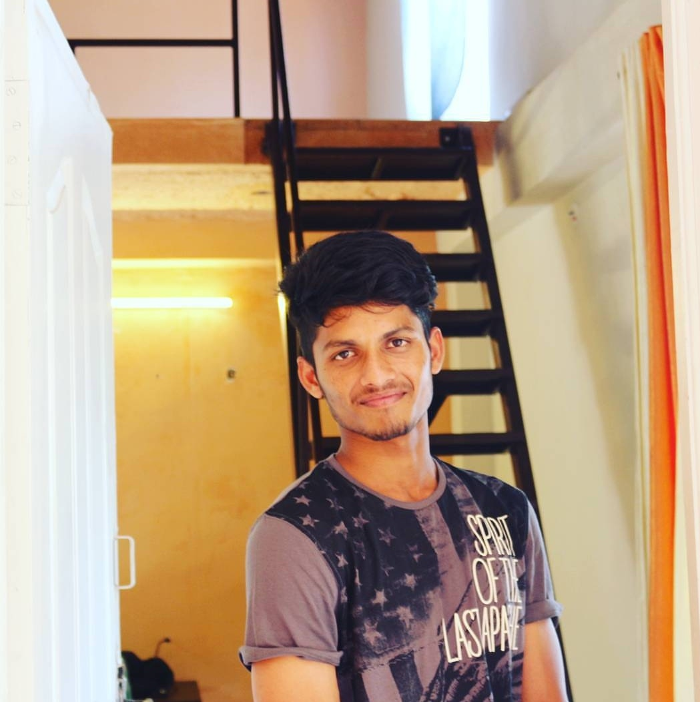

# about-me

## Repository Links
- [source repository](https://github.com/Kamal4195/about-me/edit/master/README.md)
- [hosted page](https://kamal4195.github.io/about-me/)

## About
   This repo explains about the published site, recommended tools and resourses used in Github.
   
## Recommended Tools
   To publish a Github repo we require some tools(Editors and Browsers) and languages such as
### Tools
   1. Editors
   - [notepad++](https://notepad-plus-plus.org)
   - [Visual Studio](https://visualstudio.microsoft.com/vs/)
   - [Eclipse](https://www.eclipse.org/downloads/)
   2. Browsers
   - [Google](https://www.google.com)
   - [Firefox](https://www.mozilla.org/en-US/firefox/new/)
### Languages
   - JavaScript
   - Python
   - Java
   - Ruby
   - PHP
   - C++
   - CSS
   - C#
   
   Reference :[https://octoverse.github.com/2017/](https://octoverse.github.com/2017/)
  
## Recommended Resources 
   For Beginners, I recommend them to go through these websites 
   - [Github](https://readwrite.com/2013/09/30/understanding-github-a-journey-for-beginners-part-1/)
   - [w3schools](https://www.w3schools.com/html/default.asp)
   - [Markdown](https://www.markdownguide.org)
   
## Contributers
   I am Kamal Reddy, studying  Master's of Applied Computer Science at Northwest Missouri State University
   
   
   
   
   
   
